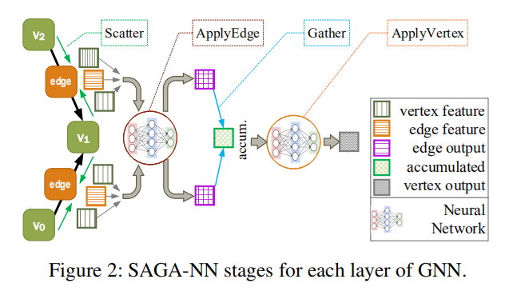
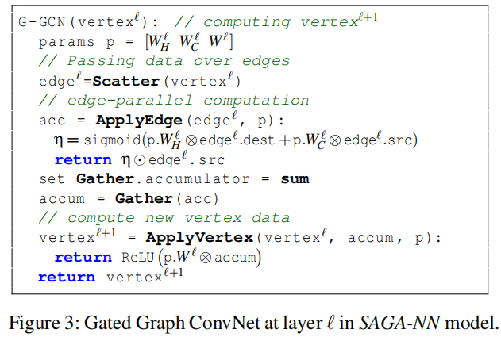
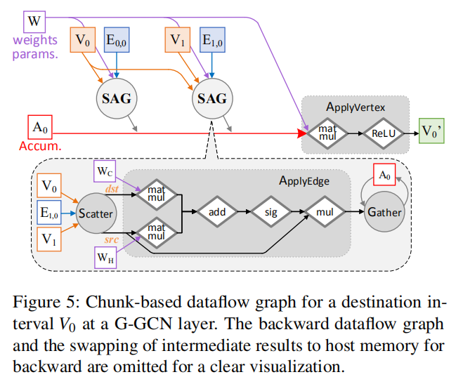
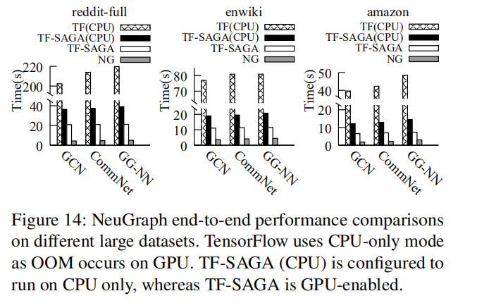
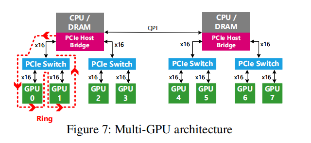
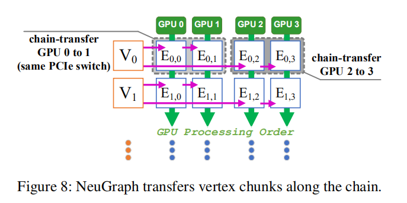
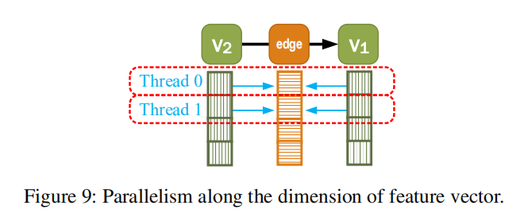
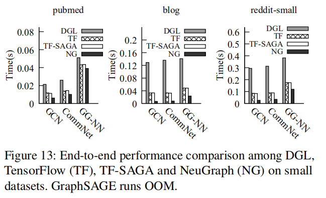
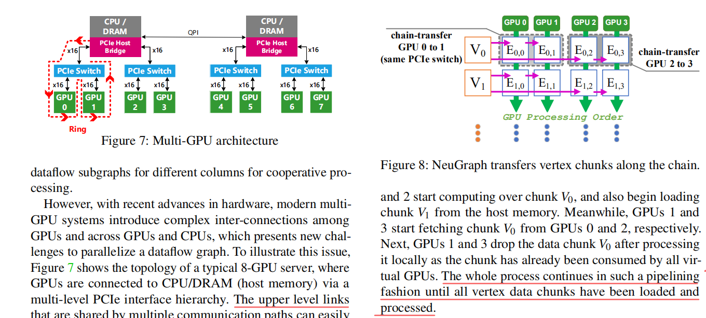

---

typora-copy-images-to: img\neugraph

---

```pdf
https://www.usenix.org/system/files/atc19-ma_0.pdf
```


NeuGraph将深度学习系统和图计算的结合，提供一个处理大规模GNN的方案。

NeuGraph将常见的GNN分为三类：图卷积网络、图循环网络、图注意力网络。并提出了SAGA-NN（Scatter-ApplyEdge-Gather-ApplyVertex with Neural Networks）编程模型。




Scatter和Gather分别是获取边和点的特征。

ApplyEdge和ApplyVertex是用户自定义的函数，通过神经网络更新边和点。





## 转换引擎

**Graph-Aware Dataflflow Translation**

将SAGA-NN表示的GNN，转换成块粒度的数据流图，使大规模GNN可以部署在GPU上。


### 图划分


将顶点数据平均的化成P块称为Vertex Feature Chunk，块于块之间的边组成Edge Chunk共有$P\times P$块。

P的大小决定每个Chunk中顶点的数量，P越小访问IO的频率就会越少，NeuGraph选则刚好满足GPU内存限制的最小的P。




为了节省GPU内存相关的Vertex Chunk和Edge Chunk在前向传播中交换到主机内存中，并在反向传播的时候交换回来。

Edge Chunk面向列处理适用于前向传播，面向行处理适用于方向传播，这样可以复用顶点的Accum，减少数据的移动。


## 流调度系统

**Streaming Processing out of GPU Core**

使用流调度系统最大的减少主机和GPU内存之间的数据移动，并最大化计算重叠。调度器需要对拓扑结构敏感，以便使用多个GPU。


### 选择性调度

**Selective Scheduling.**

对于稀疏图来说，在Vetex Chunk中不存在边的点是不会被使用的。所以NeuGraph在执行Edge Chunk时，从Vertex Chunk中选择有用的点加载到GPU中，NeuGraph采用感知位置的图划分算法Kernighan-Lin algorithm，尽可能地将连接在同一点的边压缩到一个Vertex Chunk中。



TF-SAGA（CPU）是TF（CPU）的4.3x。

对于稠密图来说，直接将点加载到GPU中会更快，因为不需要CPU额外的过滤。

基于上面两种情况，NeuGraph采用动态的检测方法，即当$\theta < \frac{T_{copy}}{T_{copy}+T_{trans}}$时采用CPU过滤。

$T_{copy}$：主机内存拷贝的吞吐量、$T_{trans}$：CPU到GPU拷贝的吞吐量。


### 流水线调度

**Pipeline Scheduling**


NeuGraph通过流水线调度，使数据传输和计算尽可能重叠，从而隐藏传输的延迟。

NeuGraph可以同时将多个chunks加载到GPU设备中，chunks的容量越小重叠的可能性就越大，chunks容量越小意味着分区P越大，这和图分区中通过降低分区P来减少IO存在矛盾。

为了解决这个矛盾，NeuGraph提供了第二层的分区方法，将edge chunk分为k个sub-chunks.

对于sub-chunks的调度，系统首先随机的生成一个调度顺序，然后不断地交换其中两个sub-chunk的顺序，在前几次迭代中可以计算chunk的计算时间和传输时间，并用来优化后面的迭代，当收敛或达到最大的迭代次数停止这个过程。


## 多GPU架构

**Parallel Multi-GPU Processing**




多GPU架构中位于同一个PCIe Switch的$GPU_0$和$GPU_1$同时从主机内存加载数据时，每个只能达到带宽的一般，这将降低GPU的运行效率。

为了解决上述问题，NeuGraph采用基于链的流调度方案，NeuGraph在逻辑上认为位于同一个PCIe Switch下的GPUs为大型虚拟GPU，并按照链式共享节点。

GPU的两部操作：

1. 从主机内存获取edge chunk和，从主机内存或从链上的前一个GPU获取data chunk。
2. 在GPU内进行计算。





$GPU_0$和$GPU_2$从主机内存中获取vertex data chunk $V_0$，然后开始计算同时开始加载$V_1$，在此期间$GPU_1$和$GPU_3$从$GPU_{0，2}$获取$V_0$，在计算完成后删除数据。


## 图传播引擎

 **Graph Propagation Engine**

基于深度学习的图传播引擎，使用一组快速传播内核和融合操作来删除内存副本。

在之前的ApplyEdge中涉及多个矩阵运算，其中Scatter作为ApplyEdge的数据输入。一个点可能连有多个边，在Scatter过程中就可能多次加载这个点，为了减少冗余，NeuGraph将依赖于相同节点的计算从ApplyEdge移到上一次迭代的ApplyVertex中。




为了更好的执行Scatter和Gather，NeuGraph提供了GPU优化的scatter/gather操作核心。

使用一个独立的线程来处理相同目标节点，如果节点的入边很多，就将这些入边分配给多个线程并行的处理。

NeuGraph提供了另一个内核执行的优化，Scatter-ApplyEdge-Gather

(SAG) stage fusion，ApplyEdge通常包括$+,-,\times,\div,tanh,sigmod,ReLU$，对于这些操作可以直接进行计算并保存在GPU寄存器中，最后将结果写入到目标节点中，避免了中间变量的生成，NeuGraph自动检测这种情况并使用特定的操作Fused-Gather来实现这个功能。




NeuGraph在blog的表现更好，因为blog的平均顶点度导致了更大的图传播成本，NeuGraph的图传播引擎可以很好的优化这一情况。


## 疑问？

### q1

EdgeNN不是应用于边的更新吗？


### q2

流水线调度是如何根据统计执行时间来进行优化后续的迭代？

将vertex chunk分成k个sub-chunk，这能减少IO次数吗？


### q3

多GPU执行过程不太理解？




